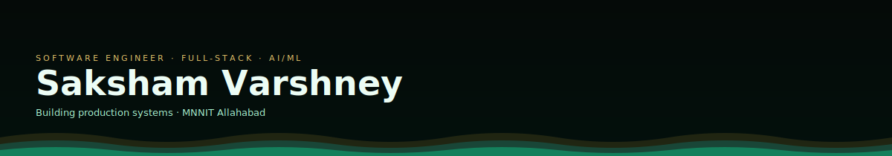

<div align="center">



<a href="https://git.io/typing-svg">
  
</a>

<br/>

<a href="https://portfolio.sakshamvarshney43.workers.dev"></a>
<a href="https://linkedin.com/in/saksham0043"></a>
<a href="mailto:sakshamvarshney43@gmail.com"></a>
<a href="https://github.com/sakshamvarshney43"></a>

<br/><br/>

</div>

<div align="center">

</div>

## About Me

I'm a Computer Science undergraduate at **Motilal Nehru National Institute of Technology, Allahabad**, focused on building production-grade full-stack systems with a strong emphasis on system design, database architecture, and secure API engineering. My work spans DAG-based data modelling, transactional data integrity, AI-assisted product features, and static analysis tooling all shipped end-to-end from schema design to deployment.

I care about the parts of engineering that don't show up in a demo GIF: query performance, race conditions, authorization boundaries, and clean CI pipelines. I approach every project with a product engineering mindset not just "does it work," but "does it scale, does it hold up under abuse, and would a senior engineer sign off on it."

<table>
<tr>
<td width="50%" valign="top">

**Education**
MNNIT Allahabad · B.Tech CSE
CPI 8.31 · 2024–2028

**Recognition**
Reliance Foundation Scholar
5,000 selected of 1,00,000+ applicants

</td>
<td width="50%" valign="top">

**Currently Exploring**
LLM-integrated product features
Distributed systems fundamentals
Advanced competitive programming

**Open To**
SDE Internships · Full-Stack Roles
Open Source Collaboration

</td>
</tr>
</table>

<div align="center">

</div>

## Tech Stack

<table>
<tr><td valign="top" width="25%"><b>Languages</b></td><td valign="top"></td></tr>
<tr><td valign="top"><b>Frontend</b></td><td valign="top"></td></tr>
<tr><td valign="top"><b>Backend & Data</b></td><td valign="top"></td></tr>
<tr><td valign="top"><b>Cloud & Tooling</b></td><td valign="top"></td></tr>
</table>

<div align="center">

</div>

## AI / ML Expertise

| Domain                              | Proficiency | Details                                                                                                                                                                               |
| ----------------------------------- | :---------: | ------------------------------------------------------------------------------------------------------------------------------------------------------------------------------------- |
| **LLM-Integrated Product Features** |   Applied   | Streamed token-by-token AI writing assistance across 5 endpoints using Gemini 2.5 Flash + Server-Sent Events, with dedicated rate-limiting middleware to prevent inference cost abuse |
| **Recommendation Systems**          |   Applied   | Trained a TF-IDF + KNN model on 6,000+ recipes for personalized, multi-constraint filtering (cuisine, meal type, diet, cook time), served via a dedicated FastAPI microservice        |
| **Classical ML Foundations**        |  Academic   | Search algorithms, adversarial search, and Naive Bayes classification implemented as part of coursework labs                                                                          |
| **Data Pipelines for ML**           |   Applied   | Built ingredient auto-suggestion and pantry-matching pipelines enabling real-time model input updates from user-contributed data                                                      |

<div align="center">

</div>

## Featured Projects

<details>
<summary><b>ForkTale — Collaborative Storytelling Platform with Git-Inspired Branching</b></summary>
<br/>

A full-stack platform that brings Git-style non-linear branching to collaborative fiction writing, backed by an 8-model relational schema and AI-assisted composition.

| Aspect          | Details                                                                                                                                                                                    |
| --------------- | ------------------------------------------------------------------------------------------------------------------------------------------------------------------------------------------ |
| **Stack**       | React.js, TypeScript, TanStack Query, Node.js, Express.js, PostgreSQL, Prisma ORM, JWT, Gemini 2.5 Flash, SSE, Cloudinary, Vercel, Railway, Neon, GitHub Actions                           |
| **Scale**       | 8-model PostgreSQL schema · 40+ REST APIs · 13 lazy-loaded frontend routes                                                                                                                 |
| **Performance** | Eliminated N+1 queries in the discovery feed (O(n) → O(1)) via nested Prisma includes; denormalized `latestCommitId` and `wordCount` to avoid expensive `ORDER BY`/`SUM` operations        |
| **Security**    | Two-tier RBAC (VIEWER/EDITOR) enforced via middleware; IDOR prevention through strict resource-ownership validation against URL params                                                     |
| **Impact**      | Atomic story forking via Prisma `$transaction` with DB-level duplicate-fork prevention; real-time AI writing assistance streamed token-by-token with cost-abuse rate limiting (10 req/min) |
| **Repository**  | [github.com/sakshamvarshney43/ForkTale](https://github.com/sakshamvarshney43/ForkTale)                                                                                                     |

ForkTale models story branching as a self-referential commit DAG (parent → child foreign key), enabling true non-linear versioning of narrative content similar in spirit to Git, but purpose-built for prose. The backend is deployed on Railway with a Neon-hosted Postgres instance, and CI runs through a two-job parallel GitHub Actions pipeline.

</details>

<details>
<summary><b>CodeEclipse — Java OOP Tree Visualizer</b></summary>
<br/>

A static-analysis and visualization platform that parses raw Java source code — without compilation — to reconstruct and render class hierarchies.

| Aspect          | Details                                                                                                    |
| --------------- | ---------------------------------------------------------------------------------------------------------- |
| **Stack**       | React.js, Node.js, Express.js, MongoDB, React Flow, JavaScript                                             |
| **Scale**       | Detects all four OOP relationship types: inheritance, aggregation, composition, and dependency             |
| **Performance** | Interactive force-directed graph rendering with zoom, pan, and minimap support for large class hierarchies |
| **Security**    | Structured error reporting and validation on uploaded source files                                         |
| **Impact**      | File upload, smart class search, and PNG/PDF diagram export for shareable architecture documentation       |
| **Repository**  | [github.com/sakshamvarshney43/Code-Eclipse](https://github.com/sakshamvarshney43/Code-Eclipse)             |

Built with a teammate, CodeEclipse's core engine parses Java source directly to extract structural relationships — a non-trivial static-analysis problem — and renders the result as an explorable, zoomable dependency graph rather than a static diagram.

</details>

<details>
<summary><b>IngrediChef — AI-Powered Recipe Recommendation Platform</b></summary>
<br/>

A recommendation engine that pairs ingredient-similarity modelling with user dietary preferences to suggest recipes and manage pantry inventory.

| Aspect          | Details                                                                                                                        |
| --------------- | ------------------------------------------------------------------------------------------------------------------------------ |
| **Stack**       | React.js, Node.js, Python, FastAPI, MongoDB, scikit-learn                                                                      |
| **Scale**       | TF-IDF + KNN model trained on 6,000+ recipes                                                                                   |
| **Performance** | Predictions served via a dedicated FastAPI microservice, decoupled from the main Node.js backend                               |
| **Security**    | Input validation on user-contributed recipe data feeding the autosuggestion pipeline                                           |
| **Impact**      | Missing-ingredient detection with auto-generated grocery lists; real-time ingredient autosuggestion from user-contributed data |
| **Repository**  | [github.com/sakshamvarshney43/IngrediChef](https://github.com/sakshamvarshney43/IngrediChef)                                   |

</details>

<div align="center">

</div>

## Experience

**Campus Ambassador & Contributor** · GirlScript Summer of Code (GSSoC)
`2025`

Represented GSSoC on campus while actively contributing to open-source projects and community discussions.

- Ranked **Top 30 nationally** among campus ambassadors and earned the **Silver Badge**
- Engaged consistently in open-source contribution workflows and community discussions

`Open Source` `Community Building` `Git/GitHub`

<br/>

**Campus Ambassador** · Techfest, IIT Bombay
`2025 – 2026`

Led campus-level outreach for one of India's largest technical festivals.

- Drove outreach and engagement for national-level technical events at IIT Bombay
- Coordinated cross-campus communication and event promotion

`Outreach` `Event Coordination` `Leadership`

<div align="center">

</div>

## Achievements

<div align="center">

| Recognition                            | Details                                                                                         |
| -------------------------------------- | ----------------------------------------------------------------------------------------------- |
| 🏆 **Reliance Foundation Scholarship** | Selected among **5,000 scholars** from **1,00,000+** applicants nationwide                      |
| 🌐 **Nextwave CPL**                    | Global Rank **539** · College Rank **28** among 1.9k+ participants across IITs, NITs, and IIITs |
| 💻 **Problem Solving**                 | **1500+** problems solved across LeetCode, Codeforces, CodeChef, and other platforms            |
| 📊 **LeetCode Weekly 507**             | Rank **542**                                                                                    |
| 📊 **CodeChef Starters 223**           | Rank **178**                                                                                    |
| 📊 **Codeforces Round 1090**           | Rank **2527**                                                                                   |

</div>

<div align="center">

</div>

## Certifications

> Certifications in progress — this section will be updated as credentials are earned.

<div align="center">


</div>


<div align="center">

</div>

## GitHub Analytics

<div align="center">



<br/>


</div>

<div align="center">

</div>

## Contribution Activity

<div align="center">

</div>

<div align="center">

</div>

## Contribution Snake

<div align="center">

</div>

<div align="center">

</div>

## Current Focus

```yaml
learning:
  - Advanced Data Structures & Algorithms
  - System Design fundamentals
  - LLM-integrated application patterns

building:
  - ForkTale (Git-inspired collaborative storytelling platform)
  - CodeEclipse (Java OOP static analysis & visualization)

exploring:
  - Operating Systems internals
  - Database internals & query optimization
  - Distributed systems fundamentals

open_to:
  - SDE Internships
  - Full-Stack Engineering Roles
  - Open Source Collaboration
```

<div align="center">

</div>

<div align="center">

_"Code is a craft — precision in the schema, discipline in the query, and clarity in the interface."_


</div>
