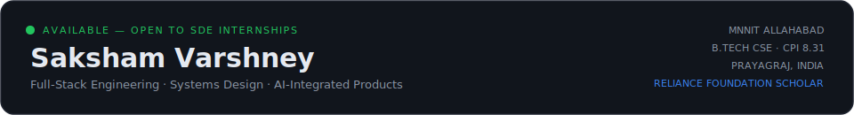
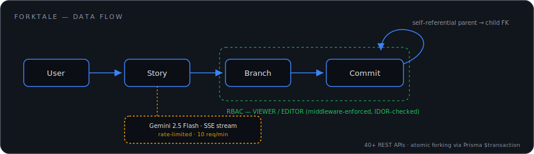
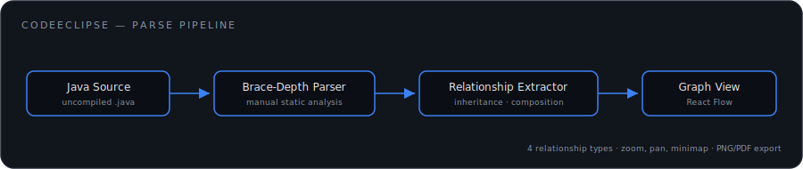
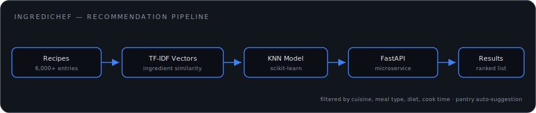

<div align="center">



</div>

<br/>

## Stack

<table>
<tr><td width="140"><sub>LANGUAGES</sub></td><td></td></tr>
<tr><td><sub>FRONTEND</sub></td><td></td></tr>
<tr><td><sub>BACKEND / DATA</sub></td><td></td></tr>
<tr><td><sub>TOOLING</sub></td><td></td></tr>
</table>

<br/>

## Systems

Three shipped projects. Each solves a distinct architectural problem rather than repeating a CRUD template.

### ForkTale — version control for prose



Story branching modeled as a self-referential commit DAG rather than a flat revision list, so forks, merges, and non-linear history work the same way Git's does — for creative writing instead of code. Forking clones `Story`, `Branch`, and `Commit` atomically inside a single Prisma transaction, with a compound unique constraint blocking duplicate forks at the database layer, not the application layer. Discovery-feed queries were N+1 until profiling caught it; nested Prisma includes brought that down to a single round trip.

`React · TypeScript · Node.js · PostgreSQL · Prisma · JWT · Gemini 2.5 Flash` → [github.com/sakshamvarshney43/ForkTale](https://github.com/sakshamvarshney43/ForkTale)

### CodeEclipse — Java structure without a compiler



Parses raw `.java` source with a hand-written brace-depth counter — no `javac`, no AST library — and reconstructs inheritance, composition, aggregation, and dependency relationships directly from tokens. Output renders as a force-directed graph with zoom, pan, and minimap, built for exploring hierarchies too large to read as a class list.

`React · React Flow · Node.js · MongoDB` → [github.com/sakshamvarshney43/Code-Eclipse](https://github.com/sakshamvarshney43/Code-Eclipse)

### IngrediChef — recommendation from what's in the fridge



TF-IDF vectorization over 6,000+ recipes feeds a KNN model served through a dedicated FastAPI microservice, decoupled from the Node.js backend so the recommendation layer can scale independently. Pantry tracking flags missing ingredients and generates grocery lists from what a user already has on hand.

`React · Node.js · Python · FastAPI · scikit-learn` → [github.com/sakshamvarshney43/IngrediChef](https://github.com/sakshamvarshney43/IngrediChef)

<br/>

## Signal

<table>
<tr><td width="220"><sub>PROBLEM SOLVING</sub></td><td>1,500+ solved · LeetCode Knight (2015) · Codeforces Specialist (1414) · CodeChef 1641</td></tr>
<tr><td><sub>NEXTWAVE CPL</sub></td><td>Global rank 539 · College rank 28 of 1,900+ across IITs, NITs, IIITs</td></tr>
<tr><td><sub>ACADEMIC</sub></td><td>CPI 8.31 · Reliance Foundation Scholar, 5,000 of 1,00,000+ applicants</td></tr>
<tr><td><sub>OPEN SOURCE</sub></td><td>GSSoC 2025 — top 30 nationally, Silver Badge · Techfest IIT Bombay campus ambassador</td></tr>
</table>

<br/>

## Activity

<div align="center">


</div>

<div align="center">

</div>

<div align="center">

</div>

<br/>

```yaml
now:
  building: [ForkTale collaborative editing, CodeEclipse dependency view]
  learning: [system design, distributed systems fundamentals]
  open_to: [SDE internships, full-stack roles, open source]
```

<br/>

<div align="center">
<sub><a href="mailto:sakshamvarshney43@gmail.com">sakshamvarshney43@gmail.com</a> · <a href="https://linkedin.com/in/saksham0043">linkedin.com/in/saksham0043</a> · <a href="https://github.com/sakshamvarshney43">github.com/sakshamvarshney43</a></sub>
</div>

<div align="center">
<sub><a href="https://raw.githubusercontent.com/sakshamvarshney43/sakshamvarshney43/output/github-contribution-grid-snake-dark.svg">contribution snake ↗</a></sub>
</div>
